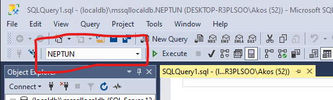
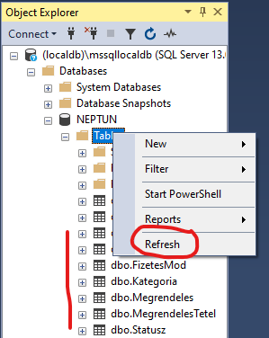

# SQL alapok

## Célkitűzés

A gyakorlat célja, hogy a hallgatók átismételjék a korábban tanult SQL alapokat, Microsoft SQL szerver környezetben, és elsajátítsák a fejlesztőeszköz használatát.

## Előfeltételek

A labor elvégzéséhez szükséges eszközök:

- [Microsoft SQL Server (LocalDB vagy Express edition)](https://docs.microsoft.com/en-us/sql/database-engine/configure-windows/sql-server-express-localdb?view=sql-server-ver15)
- [SQL Server Management Studio](https://docs.microsoft.com/en-us/sql/ssms/download-sql-server-management-studio-ssms)
- Adatbázis létrehozó script: [mssql.sql](https://raw.githubusercontent.com/BMEVIAUBB04/gyakorlat-mssql/master/mssql.sql)

Amit érdemes átnézned:

- SQL nyelv
- Microsoft SQL Server használata [segédlet](https://BMEVIAUBB04.github.io/gyakorlat-mssql/mssql-hasznalat.html) és [videó](https://web.microsoftstream.com/video/e3a83d16-b5c4-4fe9-b027-703347951621)
- A használt adatbázis [sémája](https://BMEVIAUBB04.github.io/gyakorlat-mssql/sema.html)

Felkészülés ellenőrzése:
Az alábbi mintakérdésekből 2-t fogunk feltenni, legalább 1-re helyesen kell válaszolni.
1. Hogyan lehet vizsgálni egy kifejezés nullitását?
   is null operátor segítségével

1. Miképp működik a like operátor? Milyen joker karaktereket lehet használni?
   Kif1 like String minta 

   Sting összehasonlító operátor. A Kif1-ben keres a mintának megfelelően, és ha a minta illeszthető a Kif1-re, akkor az operátor igaz értékkel tér vissza. A mintaillesztés case sensitive, a mintaillesztés során használható joker karakterek:
   _: egy betű helyettesítése
   %: tetszőleges hosszúságú szöveg helyettesítése
   '': szimpla ', mivel a szimpla ' jel önmagában a stringhatároló karakter.

1. Hogyan működnek az oszlopfüggvények?
   Az oszlopfüggvények működését úgy lehet elképzelni, hogy az adatbázis-kezelő szerver először lefuttatja a lekérdezést az oszlopfüggvények nélkül, majd az egyes rekordokat átadja az oszlopfüggvényeknek, az értékek kiszámítására. Az oszlopfüggvények használhatók csoportokra is, azaz a rekordokat csoportosíthatjuk, és ezen csoportok mentén számítunk ki különböző oszlopfüggvényeket.

1. Mire szolgál a having kulcsszó?
   Ha egy oszlopfüggvények kimenetére szeretnénk szűrni, akkor azt külön a having kulcsszó után lehet megadni.

1. Írja fel a select utasítás általános szintaktikáját!
   select [distinct] oszloplista
   from táblalista
   [where logikai kifejezés]
   [group by oszloplista]
   [having logikai kifejezés]
   [order by oszloplista]

1. Miképp lehet megadni két tábla outer joinját?
   A from részben left, right vagy full outer joint használva, pl.
   select * from gyarto left outer join termek on gyartoid=gyarto.id


## A gyakorlat menete

Az első három feladatot a gyakorlatvezetővel együtt oldjuk meg. Az utolsó feladat önálló munka. A közös feladatok megoldásai megtalálhatóak az útmutatóban is. Előbb azonban próbáljuk magunk megoldani a feladatot!

## Beadandó megoldások
A labor teljesítésének feltétele egy olyan pdf formátumú jegyzőkönyv elkészítése és feltöltése, amely azt igazolja, hogy a közös 3. feladatot, valamint az önálló 4. feladatban szereplő 10 lekérdezésből legalább az első 6-ot elkészítetted. Javasoljuk ugyanakkor, hogy a többit is próbáld megoldani. Az egyes lekérdezésekhez olyan képernyőképet kérünk a jegyzőkönyvbe, amelyen egyszerre látszik a lekérdezés és az eredménye, valamint a lekérdezésnél kommentként a Neptun kódod.

## Feladat 1: Adatbázis létrehozása

Első lépésként szükségünk lesz egy adatbázisra. Az adatbázis tipikusan egy központi kiszolgálón helyezkedik el, de fejlesztés közben sokszor a saját gépünkön fut. Mi ez utóbbi opciót választjuk.

1. Kapcsolódjon a Microsoft SQL Serverhez SQL Server Management Studio Segítségével. Indítsa el az alkalmazást, és az alábbi adatokkal kapcsolódjon.

   - Server name: `(localdb)\mssqllocaldb`
   - Authentication: `Windows authentication`

1. Hozzon létre egy új adatbázist (ha még nem létezik)! Az adatbázis neve legyen a Neptun kódja: _Object Explorer_-ben Databases-en jobb kattintás, és _Create Database_.


## Feladat 2: Adatbázis séma, mintaadatok létrehozása

1. Hozza létre a minta adatbázist a generáló script lefuttatásával. Nyisson egy új _Query_ ablakot, másolja be a [script](https://raw.githubusercontent.com/BMEVIAUBB04/gyakorlat-mssql/master/mssql.sql) tartalmát, és értelmezzük az utasításokat! A standard SQL-en kívül néhány MSSQL-specifikus kódot is találunk:

   - A script elején a meglévő táblák ellenőrzése
   - Automatikusan generált elsődleges kulcsok az IDENTITY kulcsszó segítségével
   - A SET IDENTITY_INSERT ... ON/OFF használata, hogy általunk választott azonosítókat szúrhassunk be a generált helyett
Futtassa le az utasításokat! Ügyeljen az eszköztáron levő legördülő menüben a megfelelő adatbázis kiválasztására.

   

1. Ellenőrizze, hogy létrejöttek-e a táblák. Ha a _Tables_ mappa ki volt már nyitva, akkor frissíteni kell.

   .


## Feladat 3: SQL parancsok (közös)

Írjon SQL lekérdezés/utasítást az alábbi feladatokhoz.

1. Listázza ki az összes vevőt!

   <details><summary markdown="span">Megoldás</summary>

   ```sql
   select * from Vevo
   ```
   </details>
   
1. Listázza ki, hogy eddig milyen nevű termékeket rendeltek!

   <details><summary markdown="span">Megoldás</summary>

   ```sql
   select distinct t.nev from Termek t
   join MegrendelesTetel mt on mt.TermekID=t.ID
   ```
   </details>
   
   A `join` segítségével kapcsoljuk össze a két táblát. A join, ha külön nem rendelkezünk róla, egy inner join lesz, amiben nem szerepelnek olyan termékek, amiknek nincs párjuk a MegrendelesTetel táblában. Fontos a `distinct` kulcsszó is, amivel kiszűrjük az ismétlődéseket.

1. Hány nem teljesített megrendelésünk van (a státusz alapján)?

   <details><summary markdown="span">Megoldás</summary>

   ```sql
   select count(*)
   from Megrendeles m join Statusz s on m.StatuszID = s.ID
   where s.Nev != 'Kiszállítva'
   ```

   A `join` mellett az oszlopfüggvény (aggregáció) használatára látunk példát. (A táblák kapcsolására nem csak ez a szintaktika használható.)

   </details>
   
1. Melyek azok a fizetési módok, amit soha nem választottak a megrendelőink?

   <details><summary markdown="span">Megoldás</summary>

   ```sql
   select f.Mod
   from Megrendeles m right outer join FizetesMod f on m.FizetesModID = f.ID
   where m.ID is null
   ```

   A megoldás kulcsa az `outer join`, aminek köszönhetően láthatjuk, mely fizetési mód rekordhoz _nem_ tartozik egyetlen megrendelés se.

   </details>

1. Rögzítsünk be egy új vevőt! Kérdezzük le az újonnan létrejött rekord kulcsát!

   <details><summary markdown="span">Megoldás</summary>

   ```sql
   insert into Vevo(Nev, Login, Jelszo, Email)
   values ('Teszt Elek', 't.elek', '********', 't.elek@email.com')

   select @@IDENTITY
   ```

   Az `insert` után javasolt kiírni az oszlopneveket az egyértelműség végett, bár nem kötelező. Vegyük észre, hogy az ID oszlopnak nem adunk értéket, mert azt a tábla definíciójakor meghatározva a szerver adja automatikusan. Ezért kell utána lekérdeznünk, hogy tudjuk, milyen ID-t adott.

   </details>

1. A kategóriák között hibásan szerepel az _Fajáték_ kategória név. Javítsuk át a kategória nevét *Fakockák*ra!

   <details><summary markdown="span">Megoldás</summary>

   ```sql
   update Kategoria
   set Nev = 'Fakockák'
   where Nev = 'Fajáték'
   ```

   </details>

1. Melyik termék kategóriában van a legtöbb termék?

   <details><summary markdown="span">Megoldás</summary>

   ```sql
   select top 1 Nev, (select count(*) from Termek where Termek.KategoriaID = k.ID) as db
   from Kategoria k
   order by db desc
   ```

   A kérdésre több alternatív lekérdezés is eszünkbe juthat. Ez csak egyike a lehetséges megoldásoknak. Itt láthatunk példát az allekérdezésre (subquery) is. Viszont nem ad helyes megoldást akkor, ha több olyan kategória is van, amely ugyanannyi, maximális számú terméket tartalmaz, mert csak az elsőt ilyen kategóriát adja vissza A teljesen helyes megoldás ehelyett:

   ```sql
   select k.Nev 
   from Kategoria k
     join Termek t on t.KategoriaID = k.ID
   group by k.id, k.Nev
   having count(t.id) = 
     (select max(darab) from
       (
	    select count(t.id) AS darab
        from Kategoria k join Termek t on t.KategoriaID = k.ID
		group by k.id, k.Nev
	  ) AS darabszamok
    )
   ```

   

   </details>

## Feladat 4: SQL parancsok (önálló)

1. Mely termékek ÁFA kulcsa 15%-os?
1. Az egyes telephelyekre hány rendelés volt eddig?
1. Melyik városba kérték a legtöbb rendelést?
1. Melyek azok a vevők, akik legalább 2-szer rendeltek már?
1. Mely számláknál nem egyezik meg a kiállítás és teljesítés dátuma?
1. Írjuk ki a 2008 februári rendeléseket!
1. Írjuk ki azokat a rendeléseket, amelyeknél a határidő 5 napnál szűkebb a rendelés dátumához képest!
1. Hány vevőnek van gmail-es e-mail címe?
1. Melyik vevőknek van egynél több telephelye?
1. Mely vevő(k) adták le a legtöbb tételből álló rendelést? (Több ilyen is lehet!)

---

Az itt található oktatási segédanyagok a BMEVIAUBB04 tárgy hallgatóinak készültek. Az anyagok oly módú felhasználása, amely a tárgy oktatásához nem szorosan kapcsolódik, csak a szerző(k) és a forrás megjelölésével történhet.

Az anyagok a tárgy keretében oktatott kontextusban értelmezhetőek. Az anyagokért egyéb felhasználás esetén a szerző(k) felelősséget nem vállal(nak).
